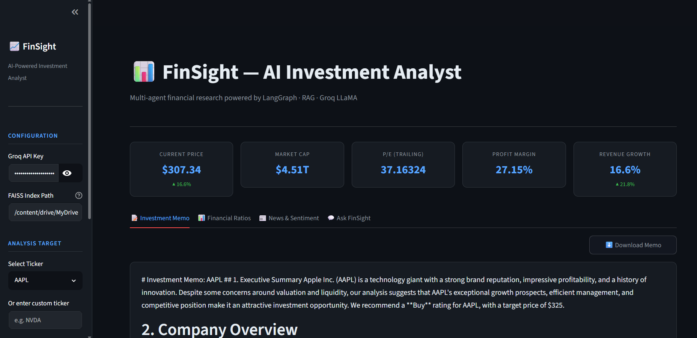
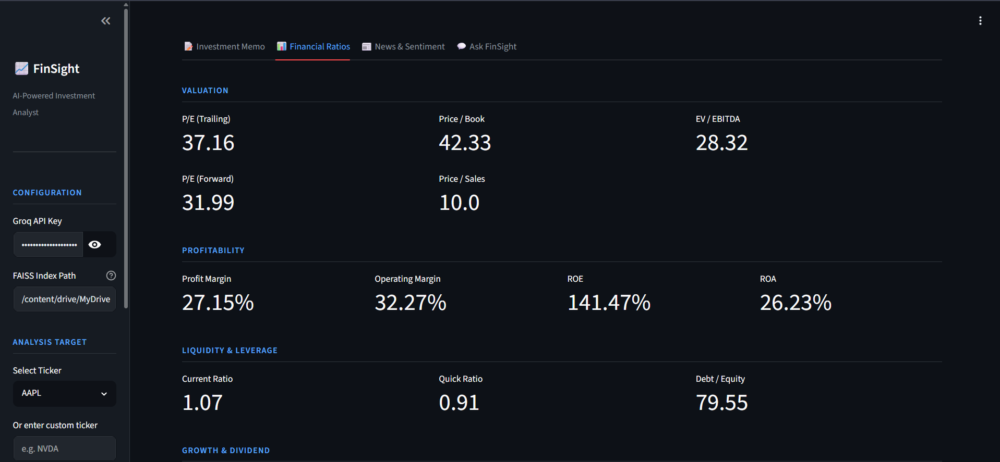
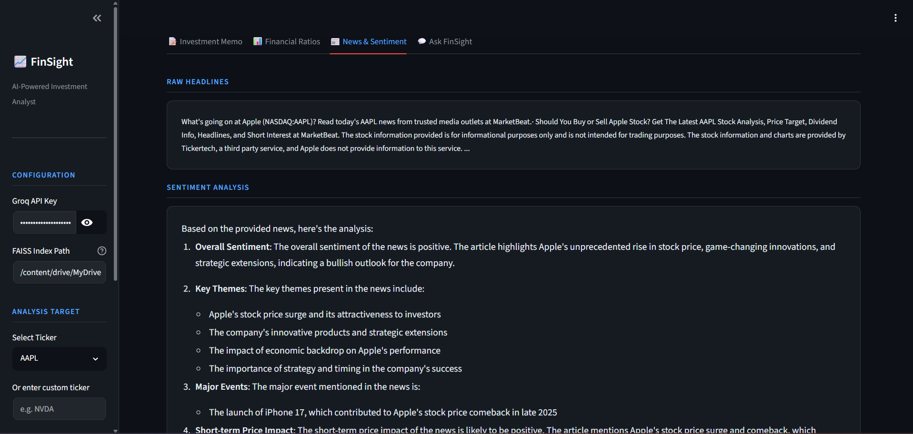
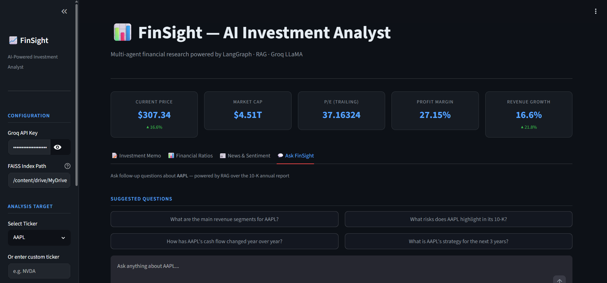
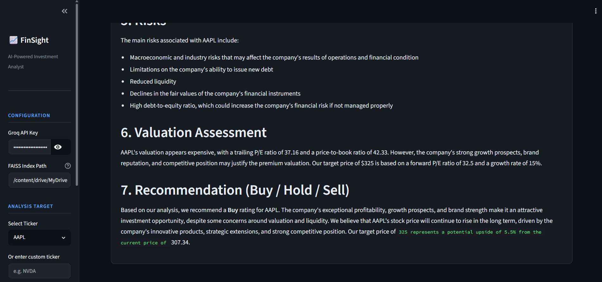

# 📈 FinSight — AI-Powered Investment Analyst

> A multi-agent financial research system built with LangGraph, RAG, Groq LLaMA, and Streamlit.  
> Generates professional investment memos in minutes by orchestrating 4 specialised AI agents.


---

## 🎯 What it does

FinSight takes a stock ticker (e.g. `AAPL`, `TSLA`) and automatically:

1. **Fetches & analyses** the latest news headlines via DuckDuckGo
2. **Retrieves insights** from SEC 10-K annual reports using RAG (FAISS + HuggingFace embeddings)
3. **Pulls live financials** — price, P/E, margins, growth, ratios via yfinance
4. **Writes a structured investment memo** with executive summary, risks, valuation, and Buy/Hold/Sell recommendation

All via a clean Streamlit UI with metric cards, tabs, and a follow-up Q&A chat interface.

---

## 🏗️ Architecture

```
User Input (Ticker)
       │
       ▼
┌─────────────────────────────────────────────────────┐
│                  LangGraph Pipeline                 │
│                                                     │
│  ┌──────────────┐    ┌──────────────┐               │
│  │ News Fetcher │───▶│  RAG Agent  │               │
│  │ DuckDuckGo   │    │ FAISS + 10-K │               │
│  └──────────────┘    └──────┬───────┘               │
│                             │                       │
│                      ┌──────▼───────┐               │
│                      │   Analyst    │               │
│                      │   yfinance   │               │
│                      └──────┬───────┘               │
│                             │                       │
│                      ┌──────▼───────┐               │
│                      │    Report    │               │
│                      │    Writer    │               │
│                      └──────┬───────┘               │
└─────────────────────────────┼───────────────────────┘
                              │
                              ▼
                  Investment Memo (Markdown)
```

| Agent | Tool | Output |
|---|---|---|
| News Fetcher | DuckDuckGo Search | Raw headlines + sentiment analysis |
| RAG Agent | FAISS + MiniLM-L6-v2 | Key insights from 10-K filing |
| Analyst Agent | yfinance + Groq | Financial ratios + LLM interpretation |
| Report Writer | Groq LLaMA 3.3 70B | Full investment memo in markdown |

---

## 🖥️ Streamlit UI

| Tab | Content |
|---|---|
| 📝 Investment Memo | Full structured memo with download button |
| 📊 Financial Ratios | Valuation, profitability, liquidity, growth metrics |
| 📰 News & Sentiment | Headlines + AI sentiment breakdown |
| 💬 Ask FinSight | RAG-powered follow-up Q&A chat over the 10-K |

---

## 🚀 Quick Start

### Prerequisites
- Google Colab (recommended) or local Python 3.10+
- [Groq API key](https://console.groq.com) (free)
- [ngrok account](https://dashboard.ngrok.com) (free, for Colab only)
- Apple and/or Tesla 10-K PDF files saved to Google Drive

### 1. Clone the repo
```bash
git clone https://github.com/YOUR_USERNAME/finsight.git
cd finsight
```

### 2. Install dependencies
```bash
pip install -r requirements.txt
```

### 3. Build the FAISS index (run once)
Open `notebooks/FinSight_Pipeline.ipynb` in Google Colab and run the **Phase 2** cells to:
- Load your 10-K PDFs
- Chunk and embed them with HuggingFace MiniLM
- Save the FAISS index to Google Drive

### 4. Launch the Streamlit app (Colab)
```python
from pyngrok import ngrok
import subprocess, time

ngrok.set_auth_token("YOUR_NGROK_TOKEN")   # from dashboard.ngrok.com

subprocess.Popen([
    "streamlit", "run", "/content/drive/MyDrive/FinSight/app.py",
    "--server.port=8501", "--server.headless=true"
])
time.sleep(4)
tunnel = ngrok.connect(8501)
print("🌐 Live at:", tunnel.public_url)
```

Then open the URL, paste your **Groq API key** in the sidebar, select a ticker, and click **Run FinSight Analysis**.

---

## 📁 Project Structure

```
finsight/
├── app.py
├── requirements.txt
├── README.md
├── .gitignore
└── src/
    ├── config.py
    ├── embeddings.py
    ├── workflow.py
    └── agents/
        ├── news_agent.py
        ├── rag_agent.py
        ├── analyst_agent.py
        └── report_agent.py
```

---

## ⚙️ Tech Stack

| Layer | Technology |
|---|---|
| LLM | Groq — LLaMA 3.3 70B Versatile |
| Orchestration | LangGraph (StateGraph) |
| RAG | FAISS + HuggingFace `all-MiniLM-L6-v2` |
| Document loading | LangChain PyPDFLoader |
| Live data | yfinance |
| News search | DuckDuckGo (LangChain tool) |
| Frontend | Streamlit |
| Deployment | Streamlit Cloud / ngrok (Colab) |

---

## 🔧 Configuration

| Parameter | Where | Description |
|---|---|---|
| `GROQ_API_KEY` | Sidebar / env var | Your Groq API key |
| FAISS index path | Sidebar | Path to saved FAISS index |
| Ticker | Sidebar | Stock ticker symbol |

Supported tickers with RAG (10-K loaded): `AAPL`, `TSLA`  
Supported tickers for live data only: any valid yfinance ticker (`MSFT`, `GOOGL`, `AMZN`, etc.)

---

## 📋 Process Followed

| Day | Phase | What was built |
|---|---|---|
| 1 | Environment | Colab setup, Groq connection, LLaMA test |
| 2 | Skeleton | LangGraph StateGraph, 4 node stubs, AgentState |
| 3 | RAG | PDF ingestion, chunking, FAISS index build |
| 4 | RAG | Retrieval chain, filtered Q&A, node integration |
| 5 | Analyst | Live stock data via yfinance |
| 6 | Analyst | Financial ratio calculation + LLM interpretation |
| 7 | News | DuckDuckGo news fetch + sentiment analysis |
| 8 | Report | Investment memo generation with prompt templates |
| 9 | UI | Streamlit frontend — sidebar, metrics, tabs, chat |
| 10 | Deploy | README, requirements, GitHub, Streamlit Cloud |

---

## 📸 App Screenshots & Feature Walkthrough

> All screenshots below are from a live AAPL analysis run on the deployed app.

---

### 🏠 Dashboard — Live Metric Cards + Investment Memo



After clicking **Run FinSight Analysis**, the dashboard instantly populates with 5 live metric cards pulled from yfinance:

| Metric | AAPL Example |
|---|---|
| Current Price | $307.34 |
| Market Cap | $4.51T |
| P/E (Trailing) | 37.16 |
| Profit Margin | 27.15% |
| Revenue Growth | 16.6% ▲ |

Below the cards, the **Investment Memo tab** renders the full AI-generated report with 7 structured sections — Executive Summary, Company Overview, Financial Health, News & Sentiment, Risks, Valuation Assessment, and Recommendation. A **Download Memo** button lets you save the report as a `.md` file.

---

### 📊 Financial Ratios Tab



A structured breakdown of all key financial ratios across 4 categories, displayed as clean metric grids:

**Valuation** — P/E Trailing (37.16), P/E Forward (31.99), Price/Book (42.33), Price/Sales (10.0), EV/EBITDA (28.32)

**Profitability** — Profit Margin (27.15%), Operating Margin (32.27%), ROE (141.47%), ROA (26.23%)

**Liquidity & Leverage** — Current Ratio (1.07), Quick Ratio (0.91), Debt/Equity (79.55)

**Growth & Dividend** — Revenue Growth, Earnings Growth, Dividend Yield

Below the grids, Groq LLaMA provides a **plain-language interpretation** of the ratios — assessing valuation, profitability, risk, and delivering a one-line verdict (Strong / Neutral / Weak).

---

### 📰 News & Sentiment Tab



The **NewsAgent** fetches the latest headlines via DuckDuckGo and splits the output into two sections:

- **Raw Headlines** — live snippet of news results for the ticker
- **Sentiment Analysis** — structured LLM breakdown including:
  - Overall sentiment (Positive / Negative / Neutral)
  - Key themes (e.g. stock price surge, iPhone 17 launch, strategic extensions)
  - Major events and announcements
  - Short-term price impact assessment

In the AAPL example, the agent identified a **positive sentiment** driven by Apple's stock comeback in late 2025, game-changing product innovations, and bullish investor outlook.

---

### 💬 Ask FinSight — RAG Chat Interface



A conversational Q&A interface powered by **RAG over the 10-K annual report**. Users can either click a suggested question or type their own query in the chat input.

**Suggested questions include:**
- What are the main revenue segments for AAPL?
- What risks does AAPL highlight in its 10-K?
- How has AAPL's cash flow changed year over year?
- What is AAPL's strategy for the next 3 years?

All answers are grounded in the actual SEC filing — not hallucinated — using FAISS similarity search filtered to the selected company's document chunks.

---

### ✅ Recommendation — Valuation & Final Verdict



The final section of the Investment Memo delivers a **data-driven Buy / Hold / Sell recommendation**. For AAPL the analysis concluded:

- **Valuation Assessment** — trailing P/E of 37.16 and price-to-book of 42.33 indicate a premium valuation, justified by strong growth prospects and brand strength. Target price: **$325** (based on forward P/E of 32.5 and 15% growth rate)
- **Risks identified** — macroeconomic exposure, debt issuance limitations, reduced liquidity, high debt-to-equity ratio
- **Recommendation: BUY** — exceptional profitability, innovative product pipeline, and competitive moat outweigh valuation concerns. Target price of $325 represents a **5.5% upside** from $307.34

---

> 💡 **Tip:** For best results, ensure the FAISS index contains the 10-K for your selected ticker. Live financial data and news work for any valid yfinance ticker even without a 10-K loaded.

---

## ⚠️ Disclaimer

FinSight is a **portfolio project for educational purposes only**.  
Nothing here constitutes financial advice. Always do your own research before making investment decisions.

---

## 📄 License

MIT License — see [LICENSE](LICENSE) for details.

---

<p align="center">Built in 10 days · Powered by LangGraph + Groq + Streamlit</p>
